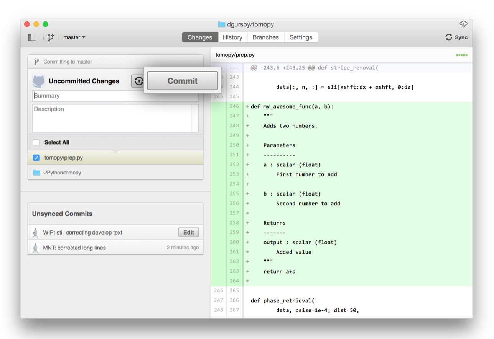

Update the docs
===============

The documentation of this web site is maintained on `github <https://github.com/>`_ 
and automatically updated on `readthedocs <https://readthedocs.org/>`_ every time there is
a new commit.

To contribute you need to **fork the repository**, **make the changes** in your fork and 
issue a **pull request**. Below are instructions  to accomplish these steps. 

Fork the repository
-------------------

This section explains the basics for developers who wish to contribute 
to a project mantained on GitHub and using the
`fork <https://help.github.com/articles/fork-a-repo/>`_ /
`pull request <https://help.github.com/articles/using-pull-requests/>`_
mechanism for accepting developer contributions.

The project is maintained on GitHub, which is a version control and a 
collaboration platform for software developers. To start first register 
on `GitHub <https://github.com>`_ and fork the 
`Project repository <https://github.com/project/project>`_ 
by clicking the **Fork** button in the header of the 
`Project repository <https://github.com/project/project>`_: 

This successfully creates a copy of the project in your personal 
GitHub space. 

Clone the repository
--------------------

The next thing you want to do is to clone the repository you just created
in your personal GitHub space to your local machine. 

You can do this by clicking the **Clone in Desktop**  button in the bottom of 
the right hand side bar:

This will launch the GitHub desktop application 
(available for both `Mac <http://mac.github.com>`_ and 
`Win <http://windows.github.com>`_) 
and ask you where you want to save it. Select a location in your 
computer and feel comfortable with making modifications in the code.

Make the changes
----------------

Once you have a local copy of the documentation repository you can start making 
changes. To verify the new resulting documentation you can build the web pages locally
and inspect them with the browser.

Build web pages locally
^^^^^^^^^^^^^^^^^^^^^^^

In your python anaconda environment create a new conda environment called docs::

    conda create --name docs python=3.9
    conda activate docs
    conda install sphinx
    conda install sphinx_rtd_theme
    conda install -c conda-forge sphinxcontrib-bibtex 

then you can build the docs locally with::

    cd your_working_directory/doc
    make html

Preview the docs
^^^^^^^^^^^^^^^^

To pre-view the results in your browser, open file:///your_working_directory/BC/doc/_build/html/index.html

to repear the doc build::

    make clean
    make html

Commiting changes
-----------------

After making some changes in the code, you may want to take a 
*snapshot* of the edits you made. That's when you make a *commit*. 
To do this, launch the GitHub desktop application and it should 
provide you all the changes in your code since your last commit.
Write a brief *Summary* and *Description* about the changes you 
made and click the **Commit** button: 

You can continue to make changes, add modules, write your own functions, 
and take more *Commit snapshots* of your code writing process.

Contributing back
-----------------

Once you feel that the functionality you added would benefit the community, 
then you should consider contributing back to the project. For this, 
go to your online GitHub repository of the project and click on the *compare*
button to compare, review and create a pull request.

After clicking on this button, you are presented with a review page 
where you can get a high-level overview of what exactly has changed
between your forked branch and the original project repository. 
When you're ready to submit your pull request, click 
**Create pull request**:

Clicking on **Create pull request** sends you to a discussion page,  
where you can enter a title and optional description. It’s important to  
provide as much useful information and a rationale for why you’re making  
this Pull Request in the first place.

When you’re ready typing out your heartfelt argument, click on **Send 
pull request**. 

You’re done!

.. This text is partially adopted from GitHub guides and Wikipedia.
