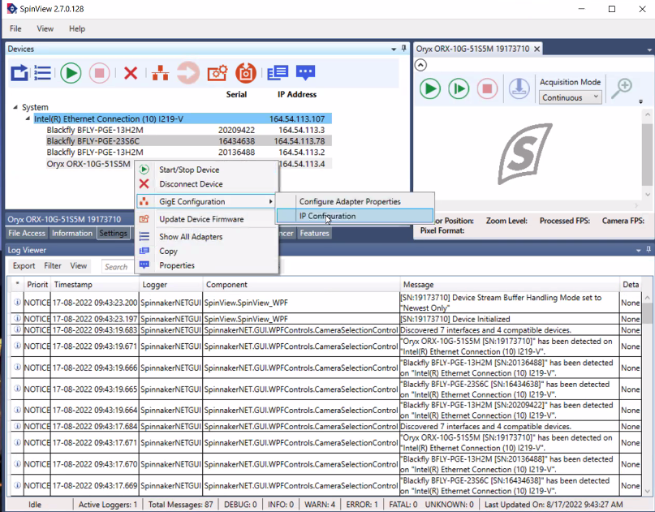
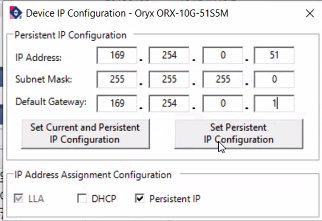

NIC for FLIR 10Ge
=================

Step-by-step to configure a FLIR 10Gb camera with an Intel Network adapter:

Prerequisites:

64GB memory
Cat 6A cable
Intel X550T2 ETHERNET CONVERGED Network Adapter X550-T2 (available from Sorcium as Part#: 3E9073)

1. Enable jumbo packet
2. Disable DHCP and set a fixed IP address on the Ethernet port connecting to the FLIR
3. Increase the receive buffer size. 
4. Increase the Network parameters in the kernel
5. Set the NIC tx queue length

1. 2. and 3. are documented at `here <https://www.flir.com/support-center/iis/machine-vision/knowledge-base/lost-ethernet-data-packets-on-linux-systems/>`_

4. is documented both at `flir doc <https://www.flir.com/support-center/iis/machine-vision/knowledge-base/lost-ethernet-data-packets-on-linux-systems/>`_ 
and in the `areadetector doc <https://areadetector.github.io/master/ADGenICam/ADGenICam.html#linux-usb-and-gige-system-settings>`_

4. edit /etc/sysctl.conf and add::

    net.core.rmem_default=26214400
    net.core.rmem_max=268435456

5. edit /etc/rc.local and add::

    /usr/sbin/ifconfig ens1f1 txqueuelen 3000

.. warning:: NIC camera settings and  10GB nic settings in this example the camera is attached to  ens1f1    

Set the NIC as follows::

    eth0: flags=4163<UP,BROADCAST,RUNNING,MULTICAST>  mtu 9000
        inet 169.254.0.68  netmask 255.255.0.0  broadcast 169.254.255.255
        inet6 fe80::260:ddff:fe42:4e2  prefixlen 64  scopeid 0x20<link>
        ether 00:60:dd:42:04:e2  txqueuelen 1000  (Ethernet)
        RX packets 248  bytes 86800 (84.7 KiB)
        RX errors 0  dropped 0  overruns 0  frame 0
        TX packets 282  bytes 26319 (25.7 KiB)
        TX errors 0  dropped 0 overruns 0  carrier 0  collisions 0

    eth1: flags=4163<UP,BROADCAST,RUNNING,MULTICAST>  mtu 9000
        inet 169.254.0.65  netmask 255.255.0.0  broadcast 169.254.255.255
        inet6 fe80::260:ddff:fe42:4e3  prefixlen 64  scopeid 0x20<link>
        ether 00:60:dd:42:04:e3  txqueuelen 1000  (Ethernet)
        RX packets 1273  bytes 445550 (435.1 KiB)
        RX errors 0  dropped 0  overruns 0  frame 0
        TX packets 281  bytes 26249 (25.6 KiB)
        TX errors 0  dropped 0 overruns 0  carrier 0  collisions 0

Then install and run `SpinView <https://flir.app.boxcn.net/v/SpinnakerSDK/folder/68522911814>`_  from FLIR

